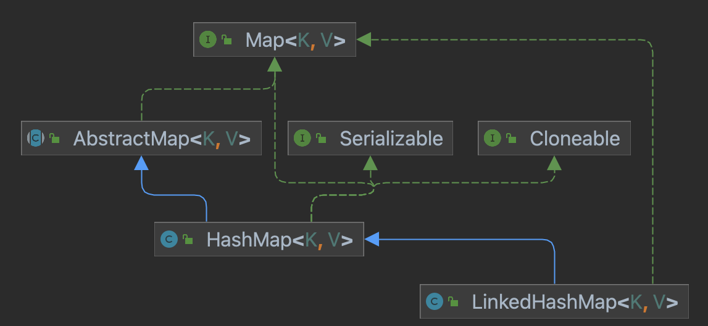
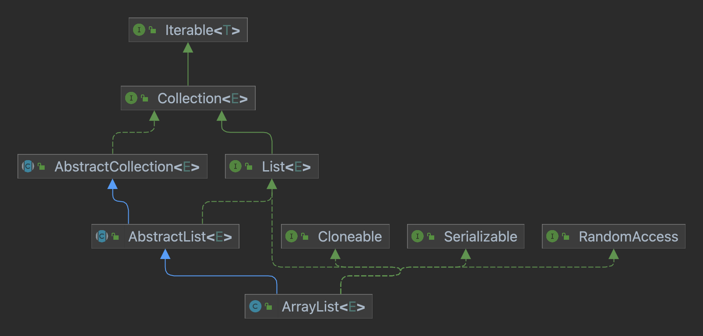
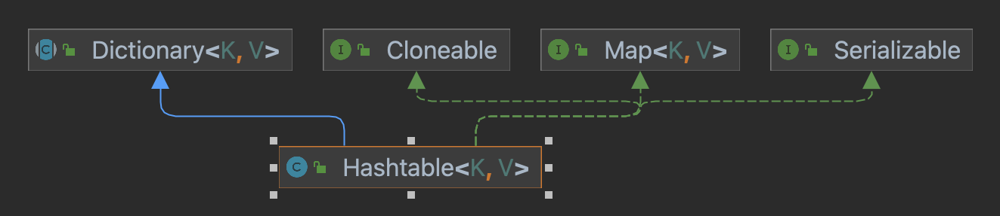
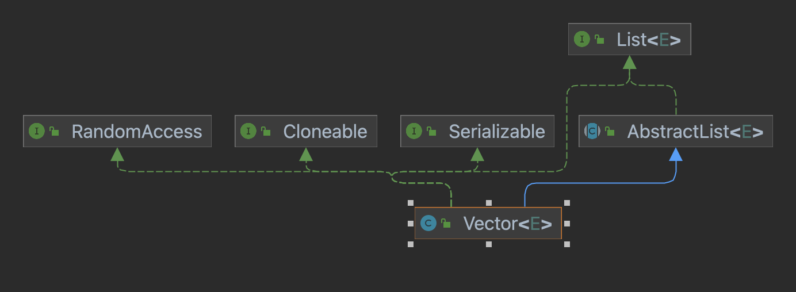

关于JDK8源码的学习，其中含有源代码注释的翻译和阅读笔记。
# 集合
## HashMap


`HashMap` 和 `HashTable` 通常是等效的，主要差别在于空值的存储。

影响 `HashMap` 性能的两个因素: **初始容量**和**加载因子**

`HashMap` 何时扩容: 当 hash 表中的条目超过加载因子和容量的乘积时，扩容并重新 hash

`HashMap` 是非线程安全的，在修改map结构时要对代码片段进行同步化。(map结构的改变是添加或删除映射，修改key对应的value不会造成结构变化)

在返回迭代器后，不能修改 map 的结构，否则抛出 `ConcurrentModificationException` 异常 (fail-fast)。

`HashMap` 类中一些属性含义:
```java
public class HashMap {
    // 默认的初始容量
    static final int DEFAULT_INITIAL_CAPACITY = 1 << 4; 
    // 默认的加载因子
    static final float DEFAULT_LOAD_FACTOR = 0.75f;
    // 链表->树阀值: 当链表中节点至少为 8，再添加节点时转为树结构
    static final int TREEIFY_THRESHOLD = 8;
    // 树->链表阀值: 在调整大小期间，链表中节点个数小于 6 时，转为链表
    static final int UNTREEIFY_THRESHOLD = 6;
    // 容器可被树化的 table 最小容量(数组)
    static final int MIN_TREEIFY_CAPACITY = 64;
    // 存储 key-value 映射的数组容器
    transient Node<K,V>[] table;
    // 集合中映射的数量
    transient int size;
    // HashMap结构上改变次数
    transient int modCount;
    // 扩容的阀值，达到了就进行扩容，计算方式: 容量*加载因子
    int threshold;
}
```
>`HashMap` 底层为数组存储，元素存储以 数组+链表/红黑树 结构，转为红黑树时 `MIN_TREEIFY_CAPACITY` 和`TREEIFY_THRESHOLD` 一起判断。
> 当数组容量达到64且链表节点达到8个(添加节点)时才会转为红黑树，否则只会对数组进行扩容。
> 当条目个数达到 0.75*容量 或 链表长度为8且容量小于64 时会扩容。
> 发生碰撞后，当链表长度大于 8 后，进入 `treeifyBin()` 判断 `HashMap` 的容量是否小于 64，为 `true` 时只进行扩容。
### HashMap 对象创建
1. new HashMap<>();

    用初始化加载因子。
2. new HashMap<>(initialCapacity)

    底层调用带有加载因子和初始容量的构造方法
3. new HashMap<>(initialCapacity, loadFactory)

   1. 判断 initialCapacity 是否小于0
      2. true 抛出初始容量不合法异常
   3. 判断 initialCapacity 是否大于最大值
      4. true initialCapacity直接赋值最大
   5. 判断加载因子是否符合要求 loadFactor <= 0 || Float.isNaN(loadFactor)
      6. false 抛出加载因子不合法异常
   7. 加载因子赋值
   8. 设置并赋值容量阀值(容量*加载因子)
### HashMap 中 put 操作
```java
public class HashMap {
   public V put(K key, V value) {
      // 执行 put 时先计算出 key 的 hash 值
      return putVal(hash(key), key, value, false, true);
   }
   
   /**
    * 求键值的hash值
    */
   static final int hash(Object key) {
      int h;
      return (key == null) ? 0 : (h = key.hashCode()) ^ (h >>> 16);
   }
   
   final V putVal(int hash, K key, V value, boolean onlyIfAbsent,
                  boolean evict) {
      // tab为存储数组元素的临时容器；n 为存储映射容器的大小；i 为存储数组容器中存储映射的索引；p 为数组index下的元素
      Node<K,V>[] tab; Node<K,V> p; int n, i; 
      if ((tab = table) == null || (n = tab.length) == 0)
         // 创建HashMap后第一次put操作  table 为HashMap存储k-v元素的数组容器，初次添加元素时 table 为 null 
         // resize() 方法，初始化容量，计算下次扩容的阀值
         n = (tab = resize()).length; 
      if ((p = tab[i = (n - 1) & hash]) == null)  
         // p = tab[index] 为null，说明在该索引下没有映射 容器存储映射的index 为 (table容器大小-1)&(h=key.hashCode())^(h>>>16)
         // 该位置下没有元素(没有发生冲突)
         tab[i] = newNode(hash, key, value, null); 
      else { 
         // 发生了 hash 碰撞
         Node<K,V> e; K k;
         if (p.hash == hash &&
                 ((k = p.key) == key || (key != null && key.equals(k)))) 
            // p 为index下的node(该索引下链表的第一个节点)  判断key是否相同 添加值node.key相同(值相同/地址相同)
            e = p;
         else if (p instanceof TreeNode) 
            // 判断该位置是否为树
            e = ((TreeNode<K,V>)p).putTreeVal(this, tab, hash, key, value);
         else { 
            // 为链表，遍历找末端
            for (int binCount = 0; ; ++binCount) { 
               // 无次数循环
               if ((e = p.next) == null) { 
                  // 当前node即为最后一个节点，新节点可追加到末尾
                  p.next = newNode(hash, key, value, null);
                  if (binCount >= TREEIFY_THRESHOLD - 1) // -1 for 1st  链表长度大于8
                     // 树化操作: 第8次时进行树化(树化前判断是否满足条件——在容器大小小于64时可能会进行扩容)
                     treeifyBin(tab, hash); 
                  break;
               }
               if (e.hash == hash &&
                       ((k = e.key) == key || (key != null && key.equals(k)))) 
                  // key 值是否有重复
                  break;
               p = e;
            }
         }
         if (e != null) { // existing mapping for key 链表中已经有一样的key，直接覆盖
            V oldValue = e.value;// key值相同，原链表中node(key)的value
            if (!onlyIfAbsent || oldValue == null)
               e.value = value; // 替换 key 相等的 value
            afterNodeAccess(e);
            return oldValue;
         }
      }
      ++modCount; // map修改次数+1
      if (++size > threshold) // 判断是否扩容
         resize();
      afterNodeInsertion(evict);
      return null;
   }
}
```
### HashMap 中 get 操作
```java
public class HashMap {
   public V get(Object key) {
      Node<K,V> e;
      // 计算key的hash值
      return (e = getNode(hash(key), key)) == null ? null : e.value; 
   }

   final Node<K,V> getNode(int hash, Object key) {
      // tab存储元素的数组 n为存储元素数组的容量 first为查找索引下的第一个节点
      Node<K,V>[] tab; Node<K,V> first, e; int n; K k; 
      if ((tab = table) != null && (n = tab.length) > 0 &&
              (first = tab[(n - 1) & hash]) != null) { 
         // 数组不为空且要查的index下有值(节点)
         if (first.hash == hash && // always check first node
                 ((k = first.key) == key || (key != null && key.equals(k)))) // 不管链表中节点个数是否大于1，比较第一个节点的hash值和key是否相等，相等则返回
            return first;
         if ((e = first.next) != null) { 
            // 链表节点多，依次查找
            if (first instanceof TreeNode) // 是否是树
               return ((TreeNode<K,V>)first).getTreeNode(hash, key);
            do { // 循环遍历，查找目标
               if (e.hash == hash &&
                       ((k = e.key) == key || (key != null && key.equals(k))))
                  return e; // 查到了，返回
            } while ((e = e.next) != null);
         }
      }
      return null;
   }
}
```
## ArrayList

`ArrayList` 是一个可变的非线程安全的数组，可以存储任何元素，包括 `null` 值，存储值有序可重复。

size，isEmpty，get，set，iterator 和 listIterator 方法时间复杂度在 常数 时间；
add 方法时间复杂度在 O(n) 时间；
其他操作 时间复杂度在 线性时间。

同样存在 `fail-fast` 问题。可通过 `Iterator` 中的 `add` 和 `remove` 方法操作元素。

`ArrayList` 中一些属性含义:
```java
public class ArrayList {
    // 默认初始容量
    private static final int DEFAULT_CAPACITY = 10;
    // 创建 ArrayList 对象指定初始容量为 0 时使用 elementData = EMPTY_ELEMENTDATA
    private static final Object[] EMPTY_ELEMENTDATA = {};
    // 创建 ArrayList 对象不指定初始容量时使用 elementData = DEFAULTCAPACITY_EMPTY_ELEMENTDATA
    private static final Object[] DEFAULTCAPACITY_EMPTY_ELEMENTDATA = {};
    // 存储 ArrayList 的元素
    transient Object[] elementData;
    // ArrayList 中存储元素的个数
    private int size;
}
```
### ArrayList 对象创建
1. 无参创建
   
   `elementData = DEFAULTCAPACITY_EMPTY_ELEMENTDATA;`
2. 指定初始容量创建

   1. 判断容量大于 0
   
      `elementData = new Object[容量];`
   2. 判断容量等于 0
      
      `elementData = DEFAULTCAPACITY_EMPTY_ELEMENTDATA;`
   3. 判断容量小于 0
   
      抛出异常
### ArrayList 中 add 操作
```java
public class ArrayList { 
    public boolean add(E e) {
        // 确保内部的容量 检查容量是否够用，不够扩容
        ensureCapacityInternal(size + 1);
        elementData[size++] = e; // 存储元素
        return true;
   }
   
   private void ensureCapacityInternal(int minCapacity) {
        // 扩容                   计算最小容量(其中判断 elementData 的地址——用无参构造的 ArrayList)
        ensureExplicitCapacity(calculateCapacity(elementData, minCapacity));
   }

   /**
    * 计算最小容量
    */
   private static int calculateCapacity(Object[] elementData, int minCapacity) {
       // 不指定初始容量创建 ArrayList 后，elementData 为 final Object[] obj = {} 的情况
       if (elementData == DEFAULTCAPACITY_EMPTY_ELEMENTDATA) {
           // 只在第一次添加时可能进入
           return Math.max(DEFAULT_CAPACITY, minCapacity); // 返回 10 和 minCapacity 的最大值
       }
       return minCapacity;
   }

   /**
    * 结构化修改次数加1，确定清晰的容量，不够扩容
    */
   private void ensureExplicitCapacity(int minCapacity) {
      // list 结构化修改次数
      modCount++; 
      if (minCapacity - elementData.length > 0) 
          // minCapacity > elementData.length 所需最小容量 > 存储元素的数组长度 容量不够，扩容
          grow(minCapacity);
   }

   /**
    * 数组扩容
    */
   private void grow(int minCapacity) {
      // 存储元素数组的长度
      int oldCapacity = elementData.length;
      // 原数组大小的 1.5 倍扩容
      int newCapacity = oldCapacity + (oldCapacity >> 1);
      // 扩容后的容量 < 所需最小容量->扩容后容量还是不够   这个所需最小容量直接赋值给新容量大小(newCapacity)
      if (newCapacity - minCapacity < 0) 
          newCapacity = minCapacity;
      // 扩容后的容量比数组大小的最大值还要大 
      if (newCapacity - MAX_ARRAY_SIZE > 0) 
          newCapacity = hugeCapacity(minCapacity);
      // minCapacity is usually close to size, so this is a win:
      elementData = Arrays.copyOf(elementData, newCapacity);
   }
}
```
### ArrayList 中 remove 操作
```java
public class ArrayList {
   public boolean remove(Object o) {
      if (o == null) { // 删除的对象为 null
         for (int index = 0; index < size; index++) // 循环找 null值
            if (elementData[index] == null) {
               fastRemove(index); // 找到了 null 元素，要删除
               return true;
            }
      } else { // 要删除的元素不为 null
         for (int index = 0; index < size; index++)
            if (o.equals(elementData[index])) {
               fastRemove(index);
               return true;
            }
      }
      return false;
   }
   private void fastRemove(int index) {
      modCount++; // 结构化修改次数减1
      int numMoved = size - index - 1; // 要删除位置的前一个元素
      if (numMoved > 0)
         System.arraycopy(elementData, index+1, elementData, index,
                 numMoved); // 复制元素
      elementData[--size] = null; // clear to let GC do its work 置空最后一个位置的元素，并将元素数量减1
   }
}
```
## HashTable

`HashTable` 集合也是存储 k-v 映射集合，但是它的 key 和 value 都不允许存储 `null`。

当一个对象作为 `key` 时，这个对象必须重写 `hashCode` 和 `equals` 方法。

同 `HashMap` 一样，也有 **加载因子** 和 **初始容量** 影响它的性能。

同样存在 `fail-fast` 问题，需要用 `Iterator` 自带的方法。

## Vector

`Vector` 是个可变长的数组，底层用 `protected Object[] elementData;` 来存储元素，可像数组一样通过下标访问元素。

`Vector` 是线程安全的。

用 `iterator()` 或 `listIterator()` 存在 `fail-fast` 问题，需要用 `iterator` 自带方法。另外，`elements()` 方法不会造成 `fail-fast` 问题。

## LinkedList

是一个双向链表，允许存储任何类型的值，包括 `null` 值。实现也是非线程安全的。

同样存在"fail-fast"问题。

## ConcurrentHashMap
支持高并发线程安全的实现，可用来替换 `HashTable`。